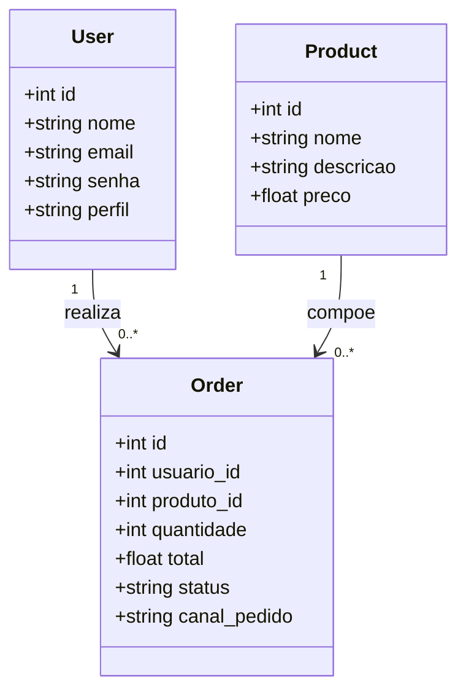

# Diagrama de Classes

Este documento apresenta o Diagrama de Classes da API Raízes do Nordeste. O objetivo é representar as principais classes utilizadas na aplicação e seus relacionamentos.

## Classes Principais

A API possui três classes principais relacionadas ao domínio do sistema:

* `User`: representa os usuários da aplicação.
* `Product`: representa os produtos disponíveis para venda.
* `Order`: representa os pedidos realizados pelos usuários.

## Descrição das Classes

### User

Representa um usuário cadastrado no sistema.

Atributos:

* `id`: identificador único do usuário.
* `nome`: nome do usuário.
* `email`: e-mail utilizado para login.
* `senha`: senha armazenada com hash.
* `perfil`: perfil do usuário, podendo ser `CLIENTE` ou `ADMIN`.

### Product

Representa um produto cadastrado no sistema.

Atributos:

* `id`: identificador único do produto.
* `nome`: nome do produto.
* `descricao`: descrição do produto.
* `preco`: preço unitário do produto.

### Order

Representa um pedido realizado por um usuário.

Atributos:

* `id`: identificador único do pedido.
* `usuario_id`: identificador do usuário que realizou o pedido.
* `produto_id`: identificador do produto solicitado.
* `quantidade`: quantidade solicitada.
* `total`: valor total calculado a partir do preço do produto e da quantidade.
* `status`: status atual do pedido, como `PENDENTE`, `PAGO` ou `RECUSADO`.
* `canal_pedido`: canal pelo qual o pedido foi realizado, como `APP`, `TOTEM`, `BALCAO`, `PICKUP` ou `WEB`.

## Relacionamentos

* Um usuário pode realizar vários pedidos.
* Um pedido pertence a um usuário.
* Um produto pode estar relacionado a vários pedidos.
* Um pedido possui um produto associado.

## Diagrama

## Observação

As classes representadas neste documento correspondem aos modelos principais da aplicação. Elas são utilizadas em conjunto com SQLAlchemy para persistência no banco PostgreSQL e com schemas Pydantic para validação e documentação dos dados na API.
