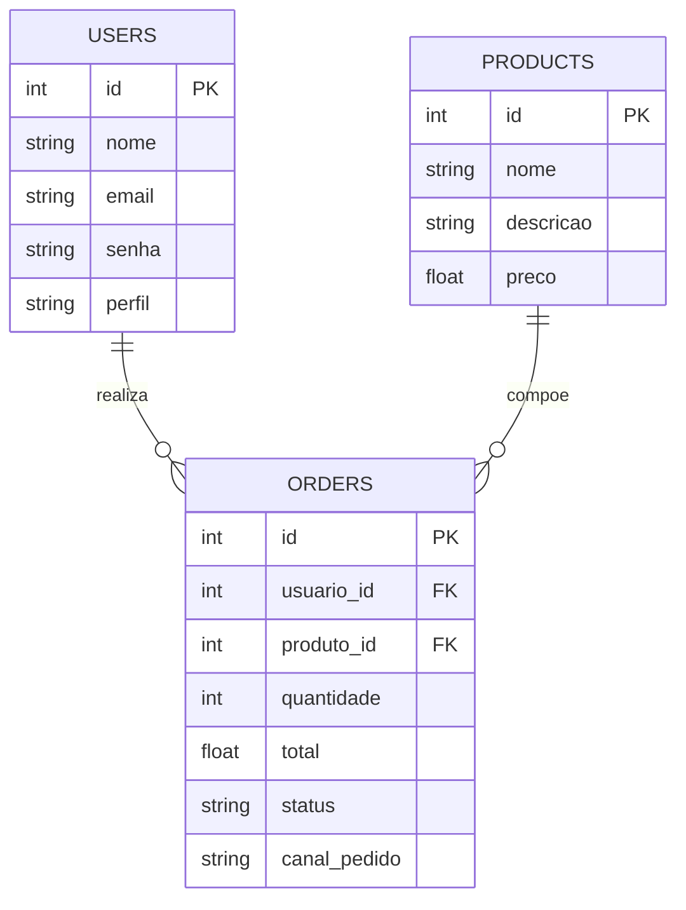

# DER - Diagrama Entidade-Relacionamento

Este documento apresenta o Diagrama Entidade-Relacionamento da API Raízes do Nordeste. O banco de dados foi modelado com três entidades principais: usuários, produtos e pedidos.

## Entidades

### users

Representa os usuários cadastrados no sistema.

Campos principais:

* `id`: identificador único do usuário.
* `nome`: nome do usuário.
* `email`: e-mail utilizado para login.
* `senha`: senha armazenada com hash.
* `perfil`: perfil do usuário, podendo ser `CLIENTE` ou `ADMIN`.

### products

Representa os produtos disponíveis para venda.

Campos principais:

* `id`: identificador único do produto.
* `nome`: nome do produto.
* `descricao`: descrição do produto.
* `preco`: preço unitário do produto.

### orders

Representa os pedidos realizados pelos usuários.

Campos principais:

* `id`: identificador único do pedido.
* `usuario_id`: referência lógica ao usuário que realizou o pedido.
* `produto_id`: referência lógica ao produto solicitado.
* `quantidade`: quantidade solicitada.
* `total`: valor total do pedido.
* `status`: situação atual do pedido, como `PENDENTE`, `PAGO` ou `RECUSADO`.
* `canal_pedido`: canal pelo qual o pedido foi realizado, como `APP`, `TOTEM`, `BALCAO`, `PICKUP` ou `WEB`.

## Relacionamentos

* Um usuário pode realizar vários pedidos.
* Um pedido pertence a um usuário.
* Um produto pode estar presente em vários pedidos.
* Um pedido está relacionado a um produto.

## Diagrama

## Observação

No código atual, os campos `usuario_id` e `produto_id` são utilizados para representar o relacionamento lógico entre pedidos, usuários e produtos. No DER, esses campos são representados como chaves estrangeiras por refletirem a regra de negócio do sistema.
