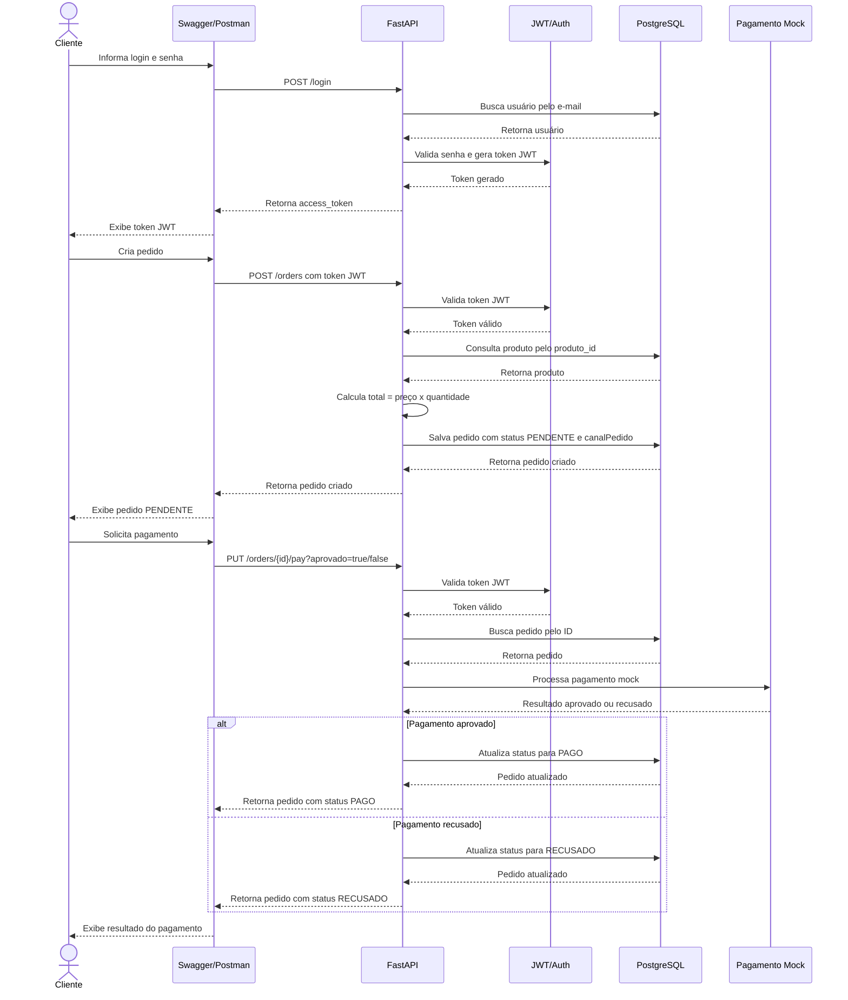

# Diagrama de Sequência - Fluxo Principal

Este documento apresenta o Diagrama de Sequência do fluxo principal da API Raízes do Nordeste, contemplando a criação de pedido, validação do produto, cálculo do total, registro do pedido, processamento do pagamento mock e atualização do status.

## Fluxo Representado

O fluxo principal implementado segue a sequência:

1. Cliente realiza login e obtém token JWT.
2. Cliente cria um pedido informando usuário, produto, quantidade e canal do pedido.
3. API valida os dados recebidos.
4. API consulta o produto no banco de dados.
5. API calcula o total do pedido.
6. Pedido é registrado com status `PENDENTE`.
7. Cliente aciona o pagamento mock.
8. API processa o pagamento como aprovado ou recusado.
9. Status do pedido é atualizado para `PAGO` ou `RECUSADO`.

## Diagrama

## Observação

O pagamento utilizado no projeto é uma simulação, também chamado de pagamento mock. Ele não se comunica com um gateway real de pagamento. A API recebe o parâmetro `aprovado`, e com base nele altera o status do pedido para `PAGO` ou `RECUSADO`.

Esse fluxo representa o principal processo de negócio da aplicação: criação do pedido, registro no banco de dados, pagamento simulado e atualização do status.
